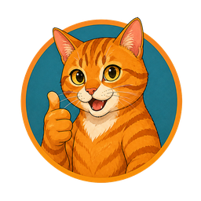
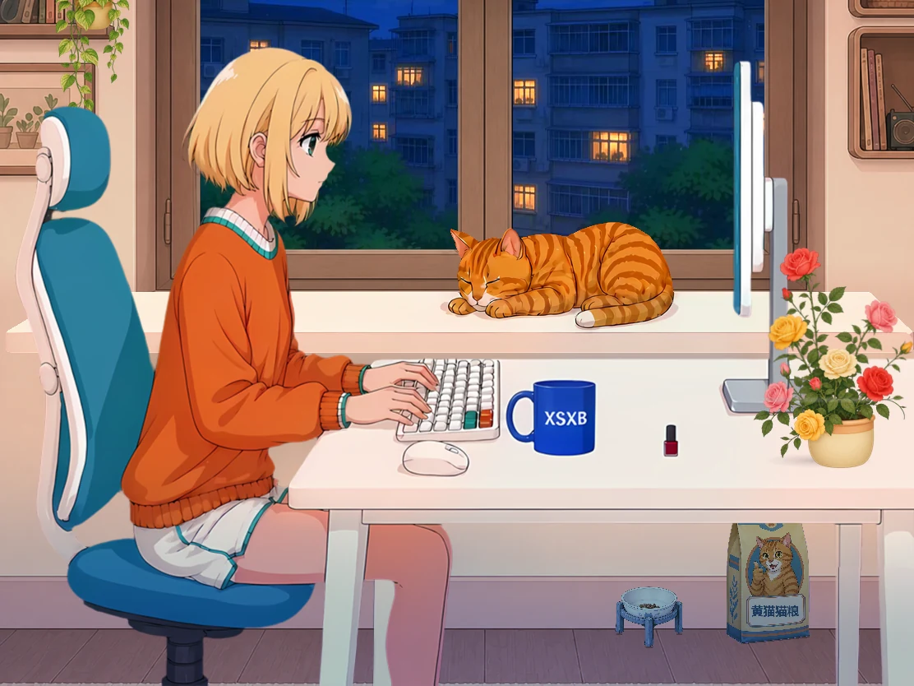
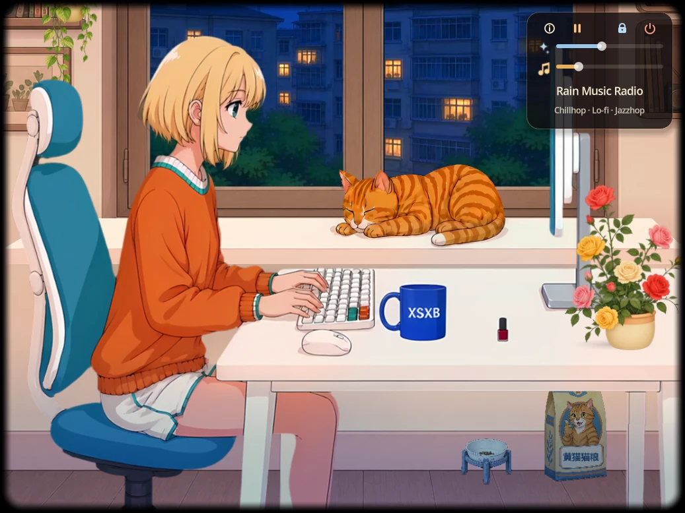
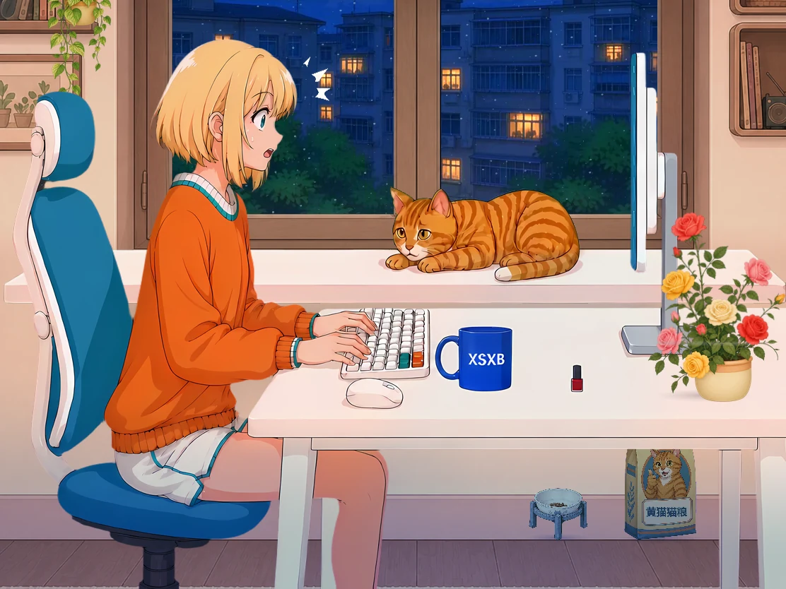

<p align="center">
  
</p>

<h1 align="center">一起磨洋工</h1>

<p align="center">
  <strong>Let's Loaf Together</strong><br>
  一个会在桌面陪你写字、敲键盘、听雨和发呆的小房间。
</p>

<p align="center">
  
  
  
  
</p>

<p align="center">
  
</p>

## 下载完整游戏

普通玩家只需要下载对应平台的完整包。美术、动画、本地音效和在线音乐播放器都已经放在包内，不需要再安装 Godot 或另外下载素材。

| 平台 | 下载 | 大小 |
| --- | --- | ---: |
| Windows | [百度网盘](https://pan.baidu.com/s/1Qxx0bIBh-HlycpYKCvYMJA?pwd=hcax) · 提取码 `hcax` | 229.14 MiB |
| macOS | [百度网盘](https://pan.baidu.com/s/1etKcApNfvNrhvXbS1TJz0g?pwd=7mt5) · 提取码 `7mt5` | 241.68 MiB |

<details>
<summary>查看文件 SHA-256 校验值</summary>

```text
Windows  a5658b46eec3b7fa1e6cb6c504803ea0fb311e65a6a11cd35a2933496a52667b
macOS    edb7b5a4340fd3a1f380a9fa9bb8ba7f1e142973004be5dcfcbf79e7f9f2fde8
```

</details>

Windows 解压后双击 `LetsLoafTogether.exe`。macOS 解压后打开“一起磨洋工.app”；当前没有 Apple 开发者签名或公证，首次打开可能出现系统安全提示。macOS 包包含 Intel 与 Apple Silicon 两种播放器，但目前只完成了包结构和架构校验，尚未在真实 Mac 上运行测试。

## 窗边正在发生什么

- 女孩和黄猫使用独立帧动画，会工作、休息，也会对天气和彼此作出反应。
- 夜窗、雨声、雷声和室内光线组成持续变化的桌面氛围。
- 猫粮袋、垫高食盆、花盆和桌面小物让房间保持生活感。
- 无边框窗口可以拖动、缩放、置顶，闲置时不会占据整块桌面。
- 内置 Rain Music Radio 控制面板，音乐音量与角色音效音量分别保存。

<table>
  <tr>
    <td width="50%"></td>
    <td width="50%"></td>
  </tr>
  <tr>
    <td align="center">右键展开极简音乐面板</td>
    <td align="center">天气会打断平静的摸鱼时光</td>
  </tr>
</table>

## 操作

| 操作 | 效果 |
| --- | --- |
| 左键拖动画面 | 移动窗口 |
| 按住 `Z` + 滚轮 | 缩放整个小房间 |
| 右键 | 显示或隐藏音乐面板 |
| 锁图标 | 保持窗口置顶 |
| 电源图标 | 确认后关闭游戏 |

窗口位置、尺寸和置顶状态会自动保存。音乐面板默认收起，并自动播放 Rain Music Radio。

## 音乐说明

在线音乐来自 Rain Music Radio 的连续直播流，以 Chillhop、Lo-fi Hip Hop 和 Jazzhop 为主。游戏不录制、不转存音乐文件，也不提供自定义 URL 输入。

- 播放器预读约 20 秒，使用 32 MB 内存缓冲并自动断线重连。
- Windows 完整包随附独立 `ffplay.exe`。
- macOS 完整包同时随附 Intel 与 Apple Silicon 版 FFplay；暂停或调节音量时会重新连接直播流。
- 电台来源、授权说明和发行边界见 [docs/radio.md](docs/radio.md)。完整包内附 FFmpeg GPL 许可证和第三方声明。

## 源码说明

本仓库保存程序代码、场景、配置、着色器、动画元数据和必要图标，供学习和继续开发使用。大体积美术、动画帧与本地音频不进入 GitHub，也不再提供单独的美术资源包；普通玩家请直接下载上面的 Windows 或 macOS 完整包。

本地拥有完整素材的开发者可使用 Godot 4.7 运行项目：

把 Godot 加入 `PATH`、放到项目根目录，或显式指定可执行文件：

```powershell
& '.\run_companion.ps1' -GodotExe 'C:\path\to\Godot_v4.7-stable_win64.exe'
```

如果缺少运行素材，`run_companion.ps1` 会停止启动并说明当前仓库不提供单独素材下载。

### 重新打包完整程序

```powershell
# 生成 Windows 与 macOS 完整包
& '.\tools\package_full_releases.ps1'

# 只重做 Windows，保留现有 macOS 包与校验值
& '.\tools\package_full_releases.ps1' -WindowsOnly
```

默认输出到同级目录 `watercolor-desk-companion-deliverables`，每个压缩包旁边都会生成独立的 `.sha256` 校验文件。

## 项目状态

当前完整包用于测试和无偿分享，项目仍处于原型阶段。Windows 包已经完成实际启动、音乐播放和退出清理测试；macOS 包尚待真实设备验证。

如果以后加入广告或付费发行，需要重新确认在线电台的商业使用范围。请保留 Rain Music Radio 名称和官网入口。

## 许可证

仓库中的程序代码以 [MIT License](LICENSE) 开源。美术、动画与音频素材不随源码仓库授权，也不作为独立资源包分发；FFplay、Godot 和在线电台分别遵循各自许可证与服务条款。
